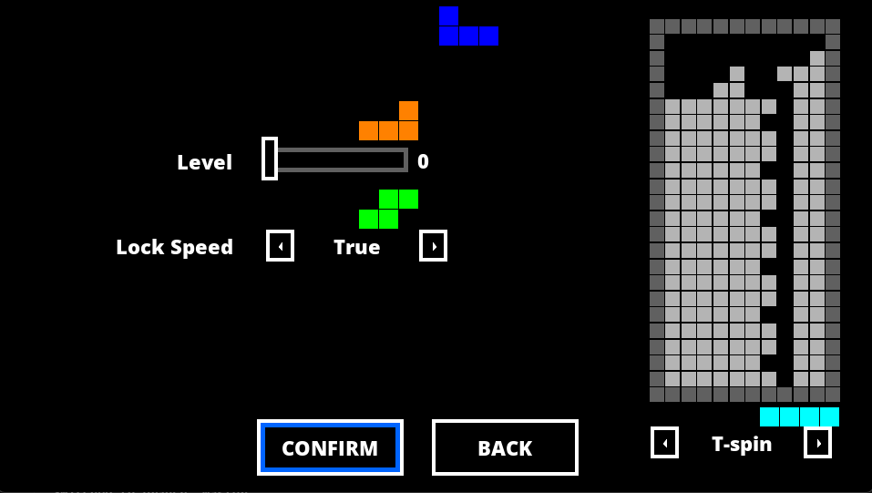
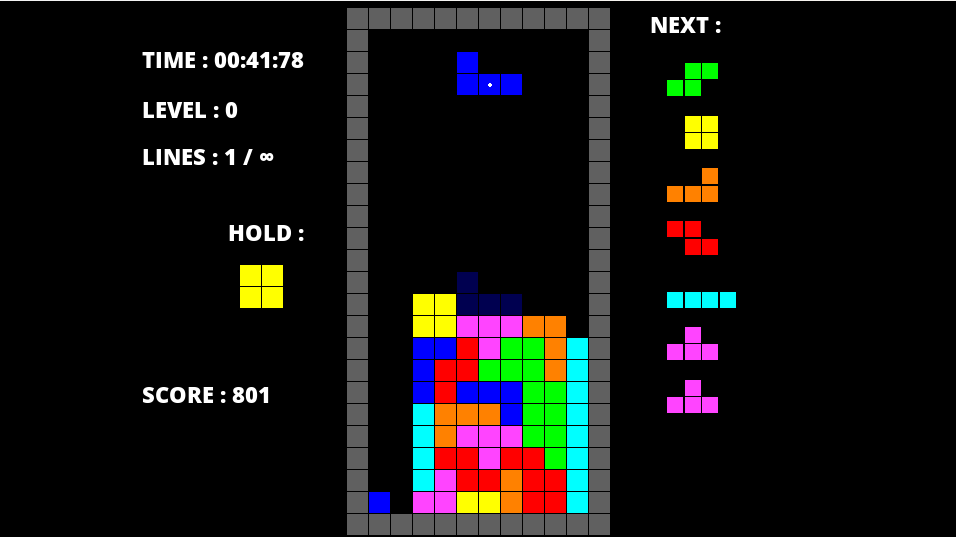

# Tetris

My attempt at making a tetris clone. This projects aims to follow as close as possible the Tetris guidelines.

## Controls

- Left : LEFT ARROW Key
- right : RIGHT ARROW Key
- Down : DOWN ARROW Key
- Hard-Drop : SPACE bar
- Rotate Clockwise : UP ARROW Key
- Rotate Counter-Clockwise : Z Key
- Rotate 180° : A Key
- Pause : ESCAPE Key

## Features

- Classic Tetris gameplay.
- Increasing difficulty level as the game progresses.
- Score tracking to keep track of your performance.
- 7-bag system.
- Super Rotation System.
- Editor mode to create custom levels.
- Practice mode.

## Modes

### Custom Mode

In the custom mode, you can set the speed and lock it, chose the which shape to generate or use the 7-bag system(random pieces), and create your own custom levels by placing blocks on the grid. Use the left click button to place a block on the grid, and the right mouse button to remove a block.


### Practice Mode

A mode where there is a preset for each tetromino, made to test and practice the SRS system(Super Rotation System).In this mode you can also select the speed and lock it.



### Classic Mode

The Classic Mode faithfully recreates the iconic gameplay of the original Tetris game.
This mode offers additional customization options, allowing players to set the speed of the falling tetrominoes and lock it to their desired level of challenge.



## How To Run

1. Make sure you have python 3.10.x or above and pygame-ce v2.2.0.
2. Clone the repository.
3. Run the following command(Make sure to run it where the project file are located).

```
python Main.py
```

## Made Using

Python version 3.11 and Pygame-ce v2.2.0.

## Sources

https://harddrop.com/wiki/Tetris_Wiki/SRS

https://harddrop.com/wiki/Scoring

https://harddrop.com/wiki/Tetris_Worlds

## Sound assets from:

https://github.com/dcts/tetris-spheres

https://you.have.fail/

https://gamebanana.com/sounds/download/44751#FileInfo_425499

## TODO:

- ~~redraw blocks.~~
- ~~refactor all of the game classes into a single one (into the main one).~~
- add a gameover sound effect.
- save dig mode time.
